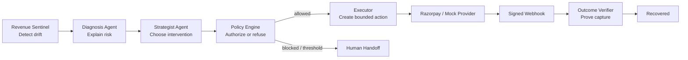

# RecoverOS

> **Recover revenue without spending customer trust.**

[](https://github.com/Tayab-Ahamed/RecoverOS/actions/workflows/ci.yml) [](LICENSE) [](https://razorpay.com/buildathon/)

RecoverOS is a **policy-governed agentic revenue recovery control plane** for failed payments, checkout drop-offs, subscription failures, and overdue receivables. It detects revenue drift, diagnoses what is happening, proposes the smallest useful intervention, passes that proposal through deterministic guardrails, executes only authorized actions, and counts recovery only after signed payment-provider evidence.

> **AI proposes. Policy authorizes. Providers execute. Webhooks verify.**

RecoverOS is not a chatbot attached to a payments table. It is a bounded operating system for the moment between **payment failure** and **verified comeback**.

---

## Why this is different

Most recovery systems stop at a list of failed payments or a fixed retry sequence. RecoverOS closes the loop while keeping the cost of automation visible.

| Conventional recovery | RecoverOS |
| --- | --- |
| Sends the same retry to everyone | Chooses a proportionate intervention from case evidence |
| Treats AI output as an instruction | Treats AI output as a proposal that must pass deterministic policy |
| Counts an API response as success | Counts revenue only after a captured-payment webhook is verified |
| Hides unsafe edge cases | Makes opt-outs, ceilings, escalations, and refusals first-class states |
| Optimizes only for gross recovery | Measures recovered money, customer contacts, policy cost, and auditability |
| Looks like an admin table | Presents a Revenue Observatory with Mission Control, Agent Fleet, Decision Theatre, and Proof Lab |

> An agent that cannot be told **no** is not deployable in payments.

---

## The AI and agentic loop

RecoverOS uses multiple bounded agents with explicit responsibilities. The agents reason about a case; they do not get direct access to the provider or the authority to declare success.



| Agent or control | Responsibility | Hard boundary |
| --- | --- | --- |
| `REVENUE_SENTINEL` | Detect revenue at risk and prioritize the field | Cannot contact a customer or call a provider |
| `DIAGNOSIS_AGENT` | Produce a structured failure hypothesis, evidence, risk factors, and recovery probability | Cannot execute or mark a case recovered |
| `STRATEGIST_AGENT` | Compare interventions, estimate expected recoverable value, and propose the next move | Cannot bypass policy or reach the provider |
| `POLICY_ENGINE` | Enforce consent, retry/contact ceilings, approval thresholds, discounts, and provenance | Cannot reason freely or call a provider |
| `EXECUTOR` | Perform the exact action authorized by policy | Cannot self-authorize or execute unapproved work |
| `OUTCOME_VERIFIER` | Verify signed provider events and captured-payment evidence | Cannot treat authorization or intent as recovered money |

When a live LLM is configured, structured model output is validated and treated like any other proposal. Offline mode uses a transparent, reproducible evidence-backed fallback so the loop can be demonstrated without credentials.

---

## The Revenue Observatory

The frontend is designed as a **merchant command center**, not a generic AI dashboard.

### Mission Control

Mission Control leads with recovery value and agent activity. The Recovery Pulse shows verified revenue returned to orbit, floating value, capture-backed conversion, and control status.

The **Revenue River** turns a payment case into a visible journey across `SIGNAL → DIAGNOSIS → PROPOSAL → POLICY → PROOF`. Each signal capsule is interactive.

The **AI & Agentic Control Plane** exposes the four agents, their statuses, execution trace, and broadcast stream derived from audit events. The **Focus Capsule** shows the selected signal’s evidence, expected value, contact budget, proposed intervention, and restraint state.

### Proof Lab

Proof Lab compares the adaptive planner with a fixed payment-link baseline on the same synthetic batch and under the same policy gate. It also shows the ungoverned risk arm so reviewers can see what unsafe automation buys—and what it costs.

### Case Ledger

The ledger is the audit surface for every transition, policy decision, provider call, webhook, refusal, escalation, and verified outcome. It answers: **“Why did we contact this customer, and what proves that the money arrived?”**

---

## Measured AI value

These figures come from the committed seeded artifact at [`evaluation/runs/run_benchmark_42_200.json`](evaluation/runs/run_benchmark_42_200.json). This is a synthetic control-system evaluation, not a production forecast.

| Arm | Recovered revenue | Recovery rate | Customer contacts | Policy violations |
| --- | ---: | ---: | ---: | ---: |
| **Adaptive agent** | **Rs 5,24,423.70** | **86.46%** | **302** | **0** |
| Fixed payment-link baseline | Rs 4,31,681.00 | 71.17% | 316 | **0** |
| Ungoverned risk demo | Rs 6,06,529.00 | 100.00% | 466 | **96** |

On this batch, the adaptive planner recovered **Rs 92,742.70 more** than the fixed baseline, recovered 26 more cases, and used 14 fewer customer contacts, while both governed arms recorded zero policy violations.

The ungoverned arm is intentionally shown. It recovers more gross money by violating the contract: it contacts opted-out or over-budget cases and creates 96 violations. RecoverOS treats that as a failure, not as a growth metric.

> **Interpretation:** these numbers demonstrate batch-scale behavior of a seeded simulation whose conversion priors were chosen by the authors. They are not a prediction of real-world recovery rates.

---

## Five invariants enforced in code

1. No case reaches `RECOVERED` without verified captured-payment evidence.
2. No provider action executes without deterministic policy authorization.
3. No case exceeds its attempt or customer-contact ceiling.
4. No opted-out customer is contacted.
5. Every financial or state transition produces an audit record.

The benchmark re-derives these invariants from the audit trail after every run. A governed run that violates one fails verification.

---

## Prove it locally

The deterministic core can be verified without Docker, network access, API keys, or a live payment account.

```bash
cd backend
python3 -m scripts.verify --quick
```

The quick verification runs architectural boundary checks, tests, narrated scenarios, and a 2,000-case governed-versus-ungoverned benchmark. For the larger reproducible benchmark:

```bash
python3 -m scripts.static_check
python3 -m unittest discover -s tests -t . -q
python3 -m scripts.demo
python3 -m scripts.run_benchmark --events 10000 --seed 42
```

The four narrated scenarios show a card-expired recovery, repeated-decline escalation, opt-out refusal, and high-value human approval.

---

## Run the full stack

The default configuration uses the deterministic mock provider and mock reasoning client.

```bash
cp .env.example .env
docker compose up --build
```

| Service | URL |
| --- | --- |
| Frontend | `http://localhost:5173` |
| Backend health | `http://localhost:8000/health` |
| API documentation | `http://localhost:8000/docs` |

For frontend development:

```bash
cd frontend
npm install
npm run dev
```

For real Razorpay Test Mode recovery, follow [`docs/RAZORPAY_TESTMODE.md`](docs/RAZORPAY_TESTMODE.md). The live path requires private Test Mode credentials and a public HTTPS webhook URL. No credentials are included here.

---

## API surfaces

| Endpoint | Purpose |
| --- | --- |
| `GET /api/v1/metrics` | Portfolio metrics and provenance summary |
| `GET /api/v1/cases` | Case ledger with optional state filtering |
| `GET /api/v1/cases/{id}` | Case detail and audit trail |
| `GET /api/v1/benchmark` | Adaptive, baseline, and ungoverned proof |
| `GET /api/v1/approvals` | Human approval queue |
| `POST /api/v1/approvals/{id}/approve` | Explicit human approval |
| `POST /api/v1/approvals/{id}/deny` | Explicit human denial |
| `POST /api/v1/webhooks/razorpay` | Signature-verified provider event intake |
| `POST /api/v1/demo/live-test-case` | Safe Razorpay Test Mode launcher |

---

## Repository map

```text
backend/app/
  domain/         Money, entities, and the state machine
  detection/      Deterministic revenue-risk signals
  agents/         Diagnosis and strategy agents; proposal only
  policies/       Versioned and checksummed authorization rules
  services/       Orchestrator, executor, verifier, audit, approvals
  integrations/   Provider protocol, Razorpay adapter, mock provider
  webhooks/       Signature verification and event identity
  evaluation/     Seeded benchmark dataset and harness
  api/            FastAPI routes and response schemas
  models/         SQLAlchemy models and migrations
frontend/
  src/components/ Revenue Observatory, Agent Fleet, Decision Theatre, Proof Lab
backend/tests/    Domain, API, webhook, SQL, idempotency, and safety coverage
docs/              Architecture, API, demo, Test Mode, concept, submission
```

---

## Verification and honest scope

| Capability | Current state |
| --- | --- |
| Domain model, money arithmetic, and state machine | Executed and tested |
| Detection, diagnosis, strategy, policy, executor, verifier | Executed and tested |
| Webhook signature verification and replay handling | Executed and tested |
| Adaptive-versus-baseline benchmark | Seeded and reproducible |
| Architectural import boundaries | Statically verified |
| FastAPI HTTP layer and SQLite persistence | Executed locally |
| React and TypeScript frontend | Production build passes |
| Razorpay Test Mode | Ready for private credentials and public webhook URL |
| Production traffic and Postgres deployment | Not included in this demo repository |

Synthetic and live data are labelled separately as `SYNTHETIC` or `LIVE_TEST_MODE`. The application refuses to mix them in one run.

---

## Documentation

| Document | Purpose |
| --- | --- |
| [`docs/ARCHITECTURE.md`](docs/ARCHITECTURE.md) | Layering, state machine, and structural guarantees |
| [`docs/API.md`](docs/API.md) | API contract and endpoint reference |
| [`docs/DEMO.md`](docs/DEMO.md) | Presenter script for the buildathon demo |
| [`docs/SUBMISSION.md`](docs/SUBMISSION.md) | Buildathon submission narrative |
| [`docs/RAZORPAY_TESTMODE.md`](docs/RAZORPAY_TESTMODE.md) | Razorpay Test Mode and webhook runbook |
| [`docs/MISSION_CONTROL_CONCEPT.md`](docs/MISSION_CONTROL_CONCEPT.md) | Product concept and interaction model |
| [`docs/INTERNSHIP_PORTFOLIO.md`](docs/INTERNSHIP_PORTFOLIO.md) | Portfolio-ready project summary |

---

## Configuration and safety defaults

All configuration is supplied through environment variables and validated at startup. Production configuration refuses to boot with a mock provider, placeholder secrets, a short JWT secret, or local webhook replay enabled.

The default policy is intentionally bounded: three maximum attempts, two maximum contacts, minimum recovery value, maximum discount, and a manual-review threshold for high-value cases. Policy versions are checksummed, and every authorization records the policy version that made the decision.

---

## License

MIT. See [`LICENSE`](LICENSE).
