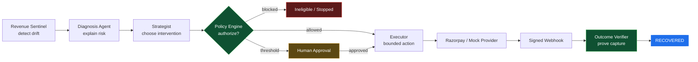

<div align="center">

# RecoverOS

**A governed agentic control plane for revenue recovery.**

AI proposes. Deterministic policy authorizes. The provider executes. Webhooks verify.

[](https://github.com/Tayab-Ahamed/RecoverOS/actions/workflows/ci.yml)
[](backend/tests)
[](evaluation/runs/run_benchmark_42_10000.json)
[](backend/scripts/check_artifacts.py)
[](https://razorpay.com/buildathon/)
[](LICENSE)


</div>

---

RecoverOS recovers revenue lost to failed payments, abandoned checkouts, failed
subscriptions and overdue receivables. It detects revenue at risk, diagnoses the
cause, proposes the smallest useful intervention, passes that proposal through a
deterministic policy gate, executes only what was authorized, and counts money
as recovered **only** after a signature-verified captured-payment webhook.

It is not a chatbot bolted onto a payments table. It is a bounded control system
for the window between **payment failure** and **verified comeback**.

> An agent that cannot be told *no* has no business touching payments.

---

## Contents

| Section | What it answers |
| --- | --- |
| [The claim](#the-claim) | What this system is measured on, and why not recovery rate |
| [Measured results](#measured-results) | The numbers, and how to reproduce them yourself |
| [Why the gateway insight matters](#the-insight-that-changed-the-design) | The one place reading Razorpay's docs changed the architecture |
| [Architecture](#architecture) | Trust boundaries, agents, and what each one may not do |
| [Prove it locally](#prove-it-locally) | One command, no network, no credentials |
| [Honest scope](#honest-scope) | What is real, what is simulated, what is unverified |

---

## The claim

Most recovery systems stop at a list of failed payments, or send a fixed retry
ladder to everyone. RecoverOS closes the loop while keeping the *cost* of
automation visible — because in dunning, the expensive resource is not compute,
it is customer patience.

**The headline metric here is deliberately not recovery rate.**

Recovery rate is trivially gamed by contacting more people. In this repository's
own benchmark, the deliberately ungoverned arm posts the best recovery rate on
the scoreboard — **90.35%** — by making **86,065** customer contacts and
committing **4,281 policy violations**. Any submission leading with recovery
rate is reporting a number that rewards harassment.

So the learner is scored on the two metrics that cannot be inflated by
contacting more people:

| Metric | Why it is honest |
| --- | --- |
| **Optimal-action rate** | Defined per decision against a hidden world model. Independent of luck. |
| **Regret** (money left on the table) | Cannot be reduced by contacting more people, only by choosing better. |

---

## Measured results

All figures below come from the committed artifact
[`evaluation/runs/run_benchmark_42_10000.json`](evaluation/runs/run_benchmark_42_10000.json)
— 10,000 events, seed 42. Every arm sees the same cases, the same policy gate,
and the same hidden world, with **common random numbers** so identical cases
face identical luck and any difference is attributable to the decision.

### Action quality — the claim being made

| Arm | Optimal action | Regret | Contacts | Violations |
| --- | ---: | ---: | ---: | ---: |
| **Learning planner** | **86.74%** | **₹9,85,715** | **12,390** | **0** |
| Hand-written rulebook | 65.69% | ₹21,43,705 | 13,700 | 0 |
| Fixed payment-link baseline | 61.61% | ₹20,42,304 | 13,613 | 0 |
| Oracle *(full knowledge, unachievable)* | 100% | ₹7 | 13,017 | 0 |
| Ungoverned risk demo | 37.92% | ₹22,46,280 | 86,065 | **4,281** |

**Learner versus the fixed baseline: +25.1 points of optimal action, 51.7% less
regret, and 1,223 fewer customer contacts.** Same money, materially less trust
spent.

### Revenue — the supporting evidence

| Arm | Recovered | Recovery rate | Share of attainable |
| --- | ---: | ---: | ---: |
| **Learning planner** | **₹2,02,68,522.95** | 70.85% | **97.45%** |
| Hand-written rulebook | ₹1,97,53,242.45 | 69.05% | 94.97% |
| Fixed payment-link baseline | ₹1,97,81,644.00 | 69.14% | 95.11% |
| Oracle *(bounds the scoreboard)* | ₹2,07,98,675.05 | 72.70% | 100% |
| Ungoverned risk demo | ₹2,58,47,718.00 | 90.35% | — *(cheats)* |

The learner captures **97.45% of the revenue the oracle proves was attainable**.
The oracle exists precisely so that a score can be read as a fraction of what
was actually possible, rather than against 100% — which is unreachable by
construction, because payer quality is latent and conversion is probabilistic.

Note the honest detail: the hand-written rulebook is **not** better than the
fixed baseline on revenue (₹1,97,53,242 versus ₹1,97,81,644). Hand-tuned
heuristics did not beat a dumb fixed action. That is the argument for learning,
and it is left visible rather than hidden.

### Reproduce every number above

```bash
cd backend
python3 -m scripts.run_benchmark --events 10000 --seed 42
python3 -m scripts.check_artifacts     # asserts committed artifacts still match code
```

`check_artifacts` re-derives every committed artifact from its own recorded seed
and diffs each metric quoted in this README. **It runs in CI.** A stale artifact
fails the build, so a published number cannot silently drift away from the code
that produced it.

<details>
<summary><b>Why that guard exists</b> (a real bug this repo shipped)</summary>

An earlier revision of this README quoted a 200-event artifact showing an 86.46%
recovery rate against a 71.17% baseline. The strategist was subsequently
rewritten; the artifact was not regenerated. Re-running the documented command
produced 73.11% against 74.96% — the headline arm was actually *losing*.

Nobody fabricated anything. The file simply went stale while the code moved. In
a project whose entire thesis is "count only what you can prove," that is the
most damaging class of bug available, so freshness is now machine-enforced
instead of asserted.

</details>

<details>
<summary><b>Model-in-the-loop shadow evaluation</b> (paired, 120 events)</summary>

From [`evaluation/runs/shadow_eval_42_120.json`](evaluation/runs/shadow_eval_42_120.json):

| Question | Metric |
| --- | --- |
| Did the model change decisions? | 10.6% influence rate |
| Did it preserve the base strategy? | 89.4% agreement |
| Did it survive known unsafe outputs? | **100% guardrail catch rate** across 26 injected faults |

In that run, model narration **slightly reduced** raw recovered revenue while
reducing regret. That is reported as-is: the LLM earns its place through
explanation and a tested safety envelope, **not** through an unsupported claim
that narration recovers more money.

</details>

> **Provenance.** These are seeded synthetic results from a simulation whose
> conversion priors were chosen by the author. They demonstrate that the control
> system behaves correctly and measurably at batch scale. They are **not** a
> forecast of production recovery rates.

---

## The insight that changed the design

Reading Razorpay's [Payment Retries](https://razorpay.com/docs/payments/subscriptions/payment-retries/)
documentation produced a correctness fix, not a cosmetic one.

When a Subscriptions auto-charge fails:

```
T+0   charge fails      → subscription moves to `pending`
T+1   Razorpay auto-retries
T+2   Razorpay auto-retries
T+3   Razorpay auto-retries
then  subscription moves to `halted`
```

For three days **the gateway is already retrying, for free, at zero contact
cost.** An agent that dunned the customer on day one would spend one of only two
permitted contacts chasing a charge the provider was about to attempt anyway —
and would then take credit for the gateway's recovery.

That inverts a core assumption: **waiting inside the gateway window is not
passivity, it is the correct action.** `subscription.halted` is the real start of
agent-led recovery, because it is the point at which the provider stops charging.

Modelled in `app/integrations/razorpay_gateway_window.py`, enforced as the
`gateway_owns_retry_window` policy rule. Three related decisions fall out of the
same reading of the docs:

- **`UNKNOWN` declines are not retryable.** An optimistic default would
  manufacture retries the evidence does not support.
- **`error_source=business` never contacts the customer.** That is our own
  malformed request; dunning someone over our integration bug is harmful.
- **RBI's 24-hour pre-debit notification rule *denies*, not escalates.** A debit
  inside that window is non-compliant, not merely impolite. A missing
  notification record is treated as a violation: absence of evidence of notice is
  absence of notice.

Full mapping, including three items explicitly marked **UNVERIFIED** against a
live account, is in [`docs/RAZORPAY_ALIGNMENT.md`](docs/RAZORPAY_ALIGNMENT.md).

---

## Architecture



Each component's **hard boundary** matters more than its capability:

| Component | Responsibility | Cannot |
| --- | --- | --- |
| `REVENUE_SENTINEL` | Detect revenue at risk, prioritize | Contact a customer or call a provider |
| `DIAGNOSIS_AGENT` | Failure hypothesis, evidence, risk factors | Execute, or mark a case recovered |
| `STRATEGIST_AGENT` | Compare interventions, estimate value, propose | Bypass policy, or reach the provider |
| `POLICY_ENGINE` | Consent, ceilings, thresholds, discounts, provenance | Reason freely, or call a provider |
| `EXECUTOR` | Perform exactly the authorized action | Self-authorize |
| `OUTCOME_VERIFIER` | Verify signed events and captured payments | Treat authorization as recovered money |

### Three structural guarantees

Each is enforced by code and covered by a test — not by convention.

**1. Reasoning cannot reach a provider.** `app.agents`, `app.detection` and
`app.policies` are forbidden from importing any provider adapter. Enforced twice:
by `import-linter` in CI, **and** by `scripts/static_check.py`, which parses the
AST and needs no installed packages — because a safety claim that can only be
checked when the network is up is not a safety claim.

**2. The executor refuses unauthorized work.** `RecoveryExecutor.execute()`
requires a `Decision` object with `allowed=True` *and* a case in state
`APPROVED`. There is no path from proposal to provider call that skips policy.

**3. The actor cannot declare its own success.** `CaseState.RECOVERED` is
writable only by `Actor.OUTCOME_VERIFIER`, only on a signature-verified webhook
carrying a captured payment. `payment.authorized` is explicitly **not** recovery.
A database `CHECK` constraint refuses a `RECOVERED` row with no evidence attached.

### Five invariants, re-derived from the audit log after every run

1. No case reaches `RECOVERED` without verified captured-payment evidence.
2. No provider action executes without deterministic policy authorization.
3. No case exceeds its attempt or customer-contact ceiling.
4. No opted-out customer is contacted.
5. Every financial or state transition produces an audit record.

The benchmark re-checks all five from the audit trail and **exits non-zero** on
violation. The governed run reports **zero across 10,000 cases**.

<details>
<summary><b>Layering, state machine, and money representation</b></summary>

```
app.api          HTTP surface, no business logic
app.services     orchestrator, executor, verifier, state machine, approvals
app.agents  app.detection  app.policies  app.integrations
app.repositories
app.models       SQLAlchemy tables
app.domain       pure: Money, states, entities, errors
app.core         config, logging, error shaping, db engine
```

Dependencies point downward only. `app.domain` imports nothing outward — not
FastAPI, not SQLAlchemy — which is why the entire recovery loop runs under a
bare interpreter with no packages installed.

**State machine:** 17 states with an explicit transition table.
`StateMachine.transition()` validates the transition, checks the actor is
permitted to write the target state, and appends an audit record.

```
happy      DETECTED → DIAGNOSING → ELIGIBLE → PLANNED → POLICY_CHECK
                   → APPROVED → EXECUTING → AWAITING_PAYMENT → RECOVERED
approval   POLICY_CHECK → AWAITING_APPROVAL → APPROVED | DENIED
retry      EXECUTING → FAILED → RETRY_ELIGIBLE → PLANNED
exhausted  EXECUTING → FAILED → MAX_ATTEMPTS → ESCALATED
refused    DIAGNOSING → INELIGIBLE            (opted out, zero probability)
```

Tested as *forbidden*: `DETECTED → RECOVERED`, `PLANNED → EXECUTING`,
`POLICY_CHECK → EXECUTING`, `DENIED → EXECUTING`. Each would be a way to move
money without authorization or claim recovery without evidence.

**Money:** integer paise everywhere, `BIGINT` in the database. `Money` rejects
float construction outright and scales through `Decimal` with explicit
`ROUND_HALF_UP`. No code path lets an amount become a binary float.

**Provenance:** every customer, event and case is labelled `SYNTHETIC` or
`LIVE_TEST_MODE`. `assert_single_provenance()` refuses to mix them in one run,
and the UI shows a red banner if mixed data is detected.

</details>

---

## Prove it locally

No Docker, no network, no credentials, no database:

```bash
cd backend
python3 -m scripts.verify --quick
```

That runs architectural boundary checks, the test suite, four narrated
scenarios, a 2,000-case governed-versus-ungoverned benchmark, and a paired LLM
shadow audit. Individually:

```bash
python3 -m scripts.static_check                      # AST boundary checks, zero deps
python3 -m unittest discover -s tests -t . -q        # 166 tests
python3 -m scripts.demo                              # four narrated scenarios
python3 -m scripts.run_benchmark --events 10000 --seed 42
python3 -m scripts.check_artifacts                   # published numbers still reproduce
python3 -m scripts.run_shadow_eval --events 120 --seed 42
```

On a bare interpreter the HTTP and SQL suites skip cleanly
(`OK (skipped=12)`); CI installs `backend/requirements.txt` and runs all 166.

### The four narrated scenarios, and why each exists

| Scenario | What it demonstrates |
| --- | --- |
| **A.** ₹8,499 expired card → recovered | The loop *executes* rather than recommends — and does not mark its own homework |
| **B.** ₹4,999 permanent decline → escalated | Stopping rules are real. The system gives up on purpose |
| **C.** ₹1,299 recoverable, customer opted out | Terminates at `INELIGIBLE`, **zero** provider calls. Money deliberately left on the table |
| **D.** ₹75,000 above threshold | Holds at `AWAITING_APPROVAL` indefinitely rather than self-approving |

Scenario C is the important one.

### Run the full stack

```bash
cp .env.example .env
docker compose up --build
```

| Service | URL |
| --- | --- |
| Frontend | `http://localhost:5173` |
| Backend health | `http://localhost:8000/health` |
| API docs | `http://localhost:8000/docs` |

Defaults use the deterministic mock provider and mock reasoning client. For real
Razorpay Test Mode, follow [`docs/RAZORPAY_TESTMODE.md`](docs/RAZORPAY_TESTMODE.md)
— it requires private Test Mode credentials and a public HTTPS webhook URL. **No
credentials are included in this repository.**

---

## API surfaces

| Endpoint | Purpose |
| --- | --- |
| `GET /api/v1/metrics` | Portfolio metrics and provenance summary |
| `GET /api/v1/cases` | Case ledger, with state filtering and pagination |
| `GET /api/v1/cases/{id}` | Case detail and full audit trail |
| `GET /api/v1/benchmark` | Learning, rulebook, baseline, oracle and ungoverned arms |
| `GET /api/v1/agents` | Learning strategist, bandit, memory, critic, LLM telemetry |
| `GET /api/v1/agents/shadow-eval` | Paired model influence and guardrail evaluation |
| `GET /api/v1/approvals` | Human approval queue |
| `POST /api/v1/approvals/{id}/approve` · `/deny` | Explicit human decision |
| `POST /api/v1/webhooks/razorpay` | Signature-verified provider event intake |
| `POST /api/v1/demo/live-test-case` | Provenance-safe Razorpay Test Mode launcher |

Full contract in [`docs/API.md`](docs/API.md).

---

## Honest scope

| Capability | State |
| --- | --- |
| Domain model, money arithmetic, state machine | Executed and tested |
| Detection, diagnosis, strategy, policy, executor, verifier | Executed and tested |
| Webhook signature verification and replay handling | Executed and tested |
| Learning-versus-baseline benchmark | Seeded, reproducible, CI drift-guarded |
| Architectural import boundaries | Statically verified, twice |
| FastAPI HTTP layer and SQLite persistence | Executed locally, restart-tested |
| React + TypeScript frontend | Production build passes in CI |
| Bandit posterior persistence | Implemented and tested |
| Propensity / memory / attribution persistence | **Process-local — not yet durable** |
| Razorpay Test Mode live run | **Adapter implemented; awaiting credentials + public webhook URL** |
| Production traffic, Postgres deployment | Not included |

Two limitations stated plainly, because they are the first questions a reviewer
should ask:

1. **The Razorpay-derived policy rules are inert on synthetic data.** They read
   from `case.event.metadata`, where real provider facts land. Synthetic
   benchmark events carry none of those keys, so those rules do not move the
   benchmark numbers — and
   `tests/test_razorpay_policy.py::TestSyntheticDataIsUnaffected` asserts
   exactly that, so if the headline figures ever shift, it will not be because
   this layer quietly started firing. They protect a live deployment; they do not
   flatter the scoreboard.

2. **Three integration details are unverified against a live account** — the
   reminder endpoint path, mandate charge via invoice issue, and
   `payment.failed` → case linkage via `notes.reference_id`. They are listed in
   `docs/RAZORPAY_ALIGNMENT.md` rather than quietly assumed.

---

## Documentation

| Document | Purpose |
| --- | --- |
| [`docs/RESULTS.md`](docs/RESULTS.md) | **Single source of truth for every number quoted anywhere in this repo** |
| [`docs/ARCHITECTURE.md`](docs/ARCHITECTURE.md) | Layering, state machine, structural guarantees |
| [`docs/AI_ARCHITECTURE.md`](docs/AI_ARCHITECTURE.md) | Learning strategist, hidden-world evaluation, LLM safety envelope |
| [`docs/RAZORPAY_ALIGNMENT.md`](docs/RAZORPAY_ALIGNMENT.md) | Product mapping, decline classes, RBI constraints, verification status |
| [`docs/API.md`](docs/API.md) | API contract and endpoint reference |
| [`docs/DEMO.md`](docs/DEMO.md) | Presenter script and zero-setup path |
| [`docs/SUBMISSION.md`](docs/SUBMISSION.md) | Buildathon submission narrative and pitch script |
| [`docs/RAZORPAY_TESTMODE.md`](docs/RAZORPAY_TESTMODE.md) | Test Mode and webhook runbook |
| [`docs/IMPLEMENTATION_DECISIONS.md`](docs/IMPLEMENTATION_DECISIONS.md) | Design decisions and their trade-offs |
| [`docs/LOCAL_RUN.md`](docs/LOCAL_RUN.md) | Local product demo walkthrough |

---

## Configuration and safety defaults

All configuration arrives through environment variables and is validated at
startup. Production configuration **refuses to boot** with a mock provider,
placeholder secrets, a short JWT secret, or local webhook replay enabled.

The default policy is intentionally bounded: 3 maximum attempts, 2 maximum
customer contacts, a minimum recovery value, a maximum discount, a contact-hours
window, and a manual-review threshold for high-value cases. Policy versions are
checksummed, and every authorization records the policy version that made the
decision.

---

<div align="center">

**AI proposes. Deterministic software authorizes. The provider executes. Webhooks verify.**

MIT licensed. See [`LICENSE`](LICENSE).

</div>
