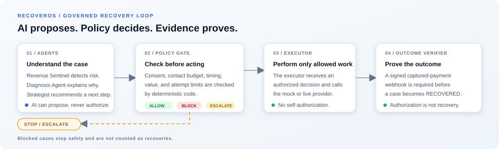
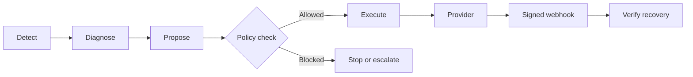

<div align="center">


**A governed recovery system for failed payments.**

AI helps diagnose and recommend. Deterministic policy decides what is allowed.
The provider executes it, and signed webhooks verify the result.

[](https://github.com/Tayab-Ahamed/RecoverOS/actions/workflows/ci.yml)
[](backend/tests)
[](backend)
[](frontend)
[](frontend)
[](docker-compose.yml)
[](docs/RESULTS.md)
[](LICENSE)

</div>

RecoverOS helps merchants handle payment failures without blindly retrying or
contacting every customer. It turns each case into a controlled workflow:

1. Detect a payment at risk.
2. Diagnose the likely cause.
3. Recommend the smallest useful recovery action.
4. Check that action against consent, contact, value, and timing rules.
5. Execute only an approved action.
6. Count the payment as recovered only after a verified captured-payment webhook.

<p align="center">
  
</p>

The system is designed to stop as deliberately as it acts. Opted-out customers,
low-value cases, unsafe actions, and cases requiring human approval are blocked
or escalated instead of being treated as automatic recoveries.

RecoverOS is built around a simple rule: a recommendation is not an action,
and an authorized payment is not a recovered payment. Each stage leaves an
auditable record so a merchant can see what happened and why.

## Product demo

The accompanying demo video shows the RecoverOS merchant dashboard, the four
agents involved in a case, diagnosis and recovery proposals, policy decisions,
escalations, stopped cases, and verified outcomes.

The demo uses synthetic evaluation data and a mock Razorpay provider. It is a
product demonstration, not a claim about production recovery rates.

## What the dashboard shows

- Portfolio recovery value and conversion metrics
- Revenue Sentinel, Diagnosis Agent, Strategist Agent, and Outcome Verifier
- Case-level diagnosis, proposal, policy, and proof states
- Recovered, escalated, ineligible, and stopped outcomes
- Audit-friendly evidence for each decision

## Why the design is governed

The agents can recommend an action, but they cannot authorize it, call the
provider directly, or declare a case recovered. The policy engine checks the
proposal first. The executor performs only an authorized action. The outcome
verifier requires signature-verified capture evidence before marking recovery.

The four roles shown in the dashboard have separate responsibilities:

| Role | Responsibility |
| --- | --- |
| Revenue Sentinel | Finds revenue at risk and prioritizes cases |
| Diagnosis Agent | Explains the likely payment failure |
| Strategist Agent | Proposes a recovery action and estimates its value |
| Outcome Verifier | Confirms the final result from provider evidence |

The policy engine sits between the strategist and executor. It checks consent,
contact limits, timing, value thresholds, and other safety rules. A blocked
case is not counted as a failed recovery attempt; it is an intentional decision
to avoid an action that is not justified.



## Run it locally

The default setup uses synthetic data and a deterministic mock provider.

```bash
cp .env.example .env
docker compose up --build
```

Then open:

| Service | URL |
| --- | --- |
| Frontend | `http://localhost:5173` |
| Backend health | `http://localhost:8000/health` |
| API docs | `http://localhost:8000/docs` |

For the local verification path:

```bash
cd backend
python3 -m scripts.verify --quick
```

This runs the architectural checks, tests, demo scenarios, benchmark, and
shadow safety evaluation. Detailed commands and results are documented in
[docs/RESULTS.md](docs/RESULTS.md).

## Project status

| Area | Status |
| --- | --- |
| Recovery workflow and policy engine | Implemented and tested |
| Agent diagnosis and recommendations | Implemented and tested |
| Signed webhook verification | Implemented and tested |
| React + TypeScript dashboard | Implemented |
| Synthetic benchmark | Reproducible and CI-checked |
| Razorpay integration | Mock provider included; Test Mode documented |

The benchmark uses seeded synthetic data. Its results demonstrate repeatable
system behavior, not expected production performance.

## Example outcomes

The demo includes several different paths through the workflow:

- A recoverable card failure receives an approved reminder or payment-link action.
- A case with a high contact history is stopped instead of receiving another message.
- An opted-out customer is marked ineligible with no provider call.
- A high-value case waits for human approval.
- A successful payment is marked recovered only after the capture webhook is verified.

These outcomes show the main purpose of the system: choosing when to act and
when to stop, rather than simply maximizing the number of recovery attempts.

## Evaluation

The repository includes a seeded benchmark comparing the learning planner with
rule-based and fixed-action baselines. It measures action quality, regret,
customer contacts, and policy violations—not just recovery rate. The committed
results can be reproduced locally, and CI checks that the published artifacts
still match the code.

The evaluation data is synthetic and uses author-defined conversion assumptions.
It is included to test the behavior of the control system consistently, not to
predict results for a live merchant.

## Documentation

- [docs/DEMO.md](docs/DEMO.md) — demo walkthrough
- [docs/SUBMISSION.md](docs/SUBMISSION.md) — submission narrative
- [docs/RESULTS.md](docs/RESULTS.md) — benchmark results and reproduction
- [docs/ARCHITECTURE.md](docs/ARCHITECTURE.md) — system boundaries and state flow
- [docs/API.md](docs/API.md) — API contract
- [docs/RAZORPAY_TESTMODE.md](docs/RAZORPAY_TESTMODE.md) — Razorpay Test Mode setup

## License

MIT. See [LICENSE](LICENSE).
