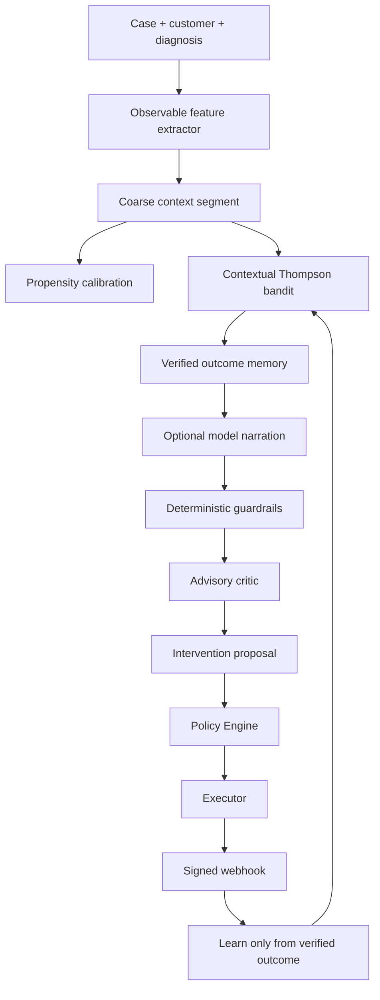

# RecoverOS AI Architecture

## Purpose

RecoverOS separates **decision quality**, **language-model quality**, and **financial correctness**. These are related, but they are not the same measurement.

The learning strategist can improve the intervention policy from verified outcomes. The language model can improve narration and raise objections. The deterministic policy engine authorizes work. The payment provider and signed webhook prove whether money arrived.

> The agent is allowed to be wrong. It is not allowed to be unbounded.

## Observable context and hidden world

The agents receive only observable case context: failure reason, event type, amount, customer value band, attempts, prior contacts, consent state, diagnosis, and verified history. The evaluation world model is kept under `app.evaluation.ground_truth` and is statically forbidden from being imported by `app.agents`, `app.detection`, or `app.policies`.

The hidden world deliberately differs from the agent's initial rule priors. It also makes the best intervention depend on failure cause, attempt number, amount, customer heterogeneity, and contact fatigue. Outcomes use common random numbers keyed by the case event, so two arms see the same luck and differ only in the decision they made.

This prevents the benchmark from silently making the agent its own answer key. It also creates an irreducible ceiling: even a perfect strategy cannot reach 100% because payer quality is latent and conversion is probabilistic.

## Learning strategist

The `LearningStrategistAgent` preserves the production contract of the original `StrategistAgent`:

```text
plan(case, diagnosis, customer) -> InterventionPlan
```

Its internal pipeline is:



The contextual bandit ranks applicable self-serve arms by sampled expected value, not probability alone. It starts from the existing rulebook prior, explores only where uncertainty exists, and updates only after the outcome verifier accepts a signed captured-payment event.

Escalation is intentionally not a bandit arm. It is a routing decision to stop betting and hand the case to a human, not an action with a comparable capture probability. The attempt ceiling remains the deterministic source of escalation.

## LLM role and safety envelope

The LLM is optional and non-load-bearing. `llm.py` provides deterministic offline behavior, scripted fault injection for evaluation, and provider adapters with strict parsing, retries, circuit breaking, response caching, PII redaction, token-cost telemetry, and spend limits.

The model may narrate a decision and may dissent **downward** toward a less aggressive action. It may not override consent, increase pressure, invent payment states, self-approve a high-value case, or declare that money was recovered.

Guardrails validate:

- required intervention and rationale fields;
- discount bounds and allowed intervention values;
- prompt-injection echoes and instruction-following attacks;
- fabricated capture claims;
- leaked email addresses, phone numbers, and key-shaped secrets;
- confidence and alternatives shape.

Invalid or unsafe model output becomes a deterministic fallback, and the rejection is counted.

## Shadow evaluation

`app.evaluation.llm_eval` runs a paired shadow comparison between a learning strategist without model narration and a learning strategist with the scripted model-in-loop. Both arms use the same generated dataset, seed, hidden world, and governed policy.

The report answers four separate questions:

| Question | Metric |
| --- | --- |
| Did the model change a decision? | Influence rate |
| Did it mostly preserve the base strategy? | Agreement rate |
| Did it survive known unsafe outputs? | Guardrail catch rate against injected faults |
| Did it produce useful reasoning? | Heuristic rationale-quality scores |

The scripted client is explicitly a **fault injector**, not evidence of model intelligence. A real provider is supported through the provider adapter, but model quality must be reported separately from deterministic safety measurements.

Run it with:

```bash
cd backend
python3 -m scripts.run_shadow_eval --events 120 --seed 42
```

Or call the reviewer endpoint outside production:

```text
GET /api/v1/agents/shadow-eval?events=120&seed=42
```

## What the measurement found

The archive's initial learner exposed three real defects through measurement rather than intuition:

1. Terminal escalation and stop decisions were not attributed an outcome, so those choices could never be punished. The harness now flushes pending decisions when a case terminates.
2. Segmenting by reason, amount band, and attempt produced too many cells for the sample size. The learning segment is now coarse enough to accumulate evidence while amount remains in the value objective.
3. A critic rule duplicated the policy contact ceiling and rewrote most actions into reminders. The critic is advisory and no longer substitutes for the policy engine.

The archive's final 2,000-event report recorded **81.0% optimal-action rate** for the learning arm versus **65.8%** for the hand-written rulebook, **Rs 3,72,369** mean regret total versus **Rs 4,26,789**, and **227 fewer customer contacts**, with zero governed policy violations. These are seeded synthetic evaluation results and not a production recovery forecast.

The paired shadow run found **89.4% agreement**, **10.6% model influence**, and a **100% catch rate against 26 known injected faults** in the scripted fault-injection design. In that run, model narration slightly reduced raw recovered revenue while reducing total regret and increasing contact count, so it is not evidence of a revenue lift. That is the honest interpretation: the model earns its place through explanation and a tested safety envelope, not an unsupported claim that narration alone recovers more money.

## Runtime configuration

```text
RECOVERY_STRATEGY=learning   # default: contextual learner
RECOVERY_STRATEGY=rules      # original hand-written rulebook baseline
LLM_PROVIDER=mock            # deterministic offline path
LLM_PROVIDER=anthropic       # live model path, requires ANTHROPIC_API_KEY
```

The main API uses the learning strategist by default in local mode. The original rulebook remains available as a controlled baseline, and the benchmark runs both arms under the same governed policy.
